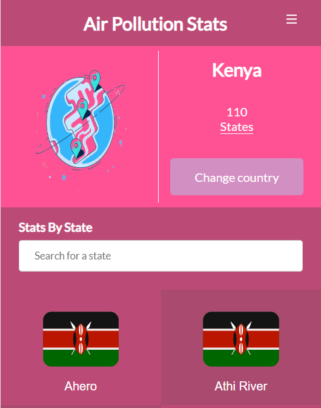

<a name="readme-top"></a>



<!-- TABLE OF CONTENTS -->

# 📗 Table of Contents

- [📖 About the Project](#about-project)

  - [🛠 Built With](#built-with)
    - [Tech Stack](#tech-stack)
    - [Key Features](#key-features)
  - [🚀 Live Demo](#live-demo)

- [💻 Getting Started](#getting-started)
  - [Setup](#setup)
  - [Prerequisites](#prerequisites)
  - [Install](#install)
  - [Usage](#usage)
  - [Run tests](#run-tests)
- [👥 Authors](#authors)
- [🔭 Future Features](#future-features)
- [🤝 Contributing](#contributing)
- [⭐️ Show your support](#support)
- [🙏 Acknowledgements](#acknowledgements)
- [📝 License](#license)

<!-- PROJECT DESCRIPTION -->

# 📖 Air Pollution Stats <a name="about-project"></a>

**Air Pollution Stats** is a webapp built with the aim of sharing information about air pollution for various regions around the globe.

## 🛠 Built With <a name="built-with"></a>

### Tech Stack <a name="tech-stack"></a>

  <ul>
    <li>
      HTML <br>   
    </li>
    <li>CSS
    </li>
    <li>React
    </li>
    <li>Redux
    </li>
  </ul>

<!-- Features -->

### Key Features <a name="key-features"></a>

- SPA - Sigle Page Application
- User Friendly

<p align="right">(<a href="#readme-top">back to top</a>)</p>

<!-- LIVE DEMO -->

## 🚀 Live Demo <a name="live-demo"></a>

- [Live Demo Link](https://air-pollution-stats.onrender.com/)

## 📹 Video Presentation <a name="live-demo"></a>

- [Video link](https://www.loom.com/share/d116f09749be4a0cbee5227913684155)

<p align="right">(<a href="#readme-top">back to top</a>)</p>

<!-- GETTING STARTED -->

## 💻 Getting Started <a name="getting-started"></a>

To get a local copy up and running, follow these steps.

### Prerequisites

In order to set up and run the application you need:

- A code editor preferably Visual Studio Code
- A web browser preferably Google chrome.

Basic requirements are needed in order to fully understand how the project fully works :

- Basic knowledge of HTML, CSS, and React.
- Intermediate knowledge of React-Redux
- How to work with Git and GitHub.

### Setup

Clone this repository to your desired folder:

```sh
  cd my-folder
  git clone https://github.com/NoelLincoln/air-pollution-stats/
```

### Install

Install this project with:

```sh
  cd air-pollution-stats
  npm install
```

### Usage

To run the project run :

```sh
  npm start
```

Runs the app in the development mode.
Open http://localhost:3000 to view it in your browser.

The page will reload when you make changes.
You may also see any lint errors in the console

### Run tests

To run tests, run the following command:

```sh
  npm test
```

Launches the test runner in the interactive watch mode.\
See the section about [running tests](https://facebook.github.io/create-react-app/docs/running-tests) for more information.

### Deployment

This project can be deployed on several platforms. Github pages is used for deployment. For detailed steps visit [deploy create-react-app](https://create-react-app.dev/docs/deployment/#github-pages).

<p align="right">(<a href="#readme-top">back to top</a>)</p>
<!-- AUTHORS -->

## 👥 Authors <a name="authors"></a>

👤 **Noel Bryant**

- GitHub: [@githubhandle](https://github.com/NoelLincoln)
- Twitter: [@twitterhandle](https://twitter.com/NoelLincoln)
- LinkedIn: [LinkedIn](https://www.linkedin.com/in/noel-bryant/)

<p align="right">(<a href="#readme-top">back to top</a>)</p>

<!-- FUTURE FEATURES -->

## 🔭 Future Features <a name="future-features"></a>

- [ ] **Desktop Version**
- [ ] **Text to voice**

<p align="right">(<a href="#readme-top">back to top</a>)</p>

<!-- CONTRIBUTING -->

## 🤝 Contributing <a name="contributing"></a>

Contributions, issues, and feature requests are welcome!

Feel free to check the [issues page](https://github.com/NoelLincoln/air-pollution-stats/issues).

<p align="right">(<a href="#readme-top">back to top</a>)</p>

<!-- SUPPORT -->

## ⭐️ Show your support <a name="support"></a>

If you like this project give a ⭐️

<p align="right">(<a href="#readme-top">back to top</a>)</p>

<!-- ACKNOWLEDGEMENTS -->

## 🙏 Acknowledgments <a name="acknowledgements"></a>

I would like to thank Microverse a lot

I would like to acknowledge [Nelson Sakwa](https://www.behance.net/sakwadesignstudio), the original creator of this design

I would like to thank [freepik](https://freepik.com/) forallowing me to use their icons

<p align="right">(<a href="#readme-top">back to top</a>)</p>

<!-- LICENSE -->

## 📝 License <a name="license"></a>

This project is [MIT](./LICENSE) licensed.

<p align="right">(<a href="#readme-top">back to top</a>)</p>
